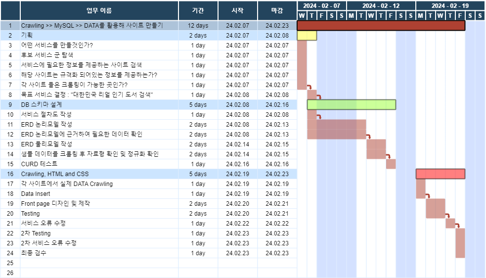
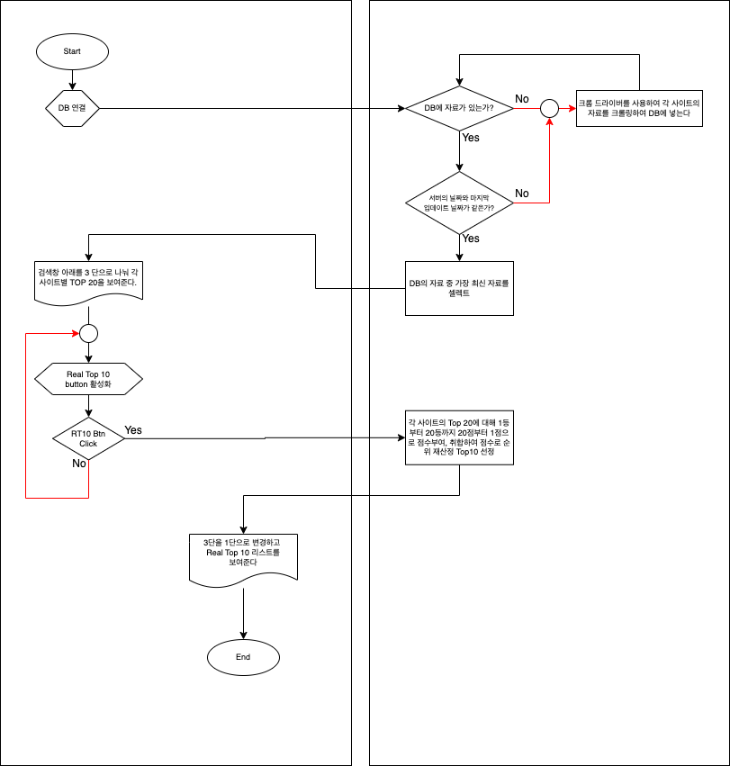
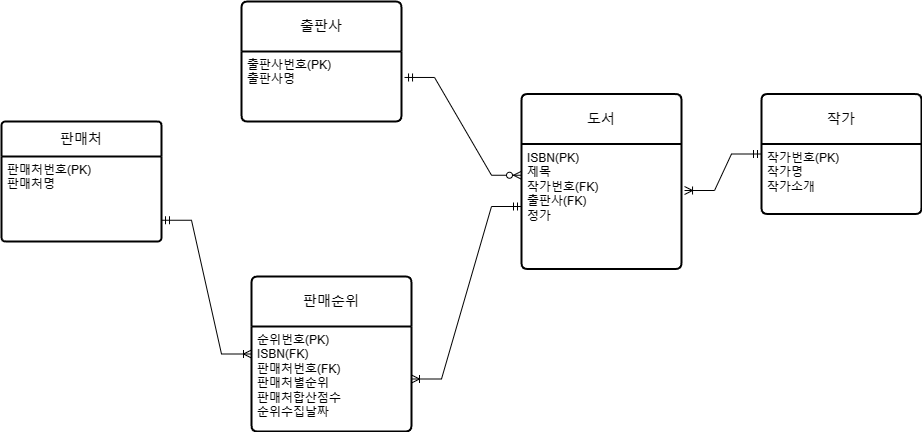
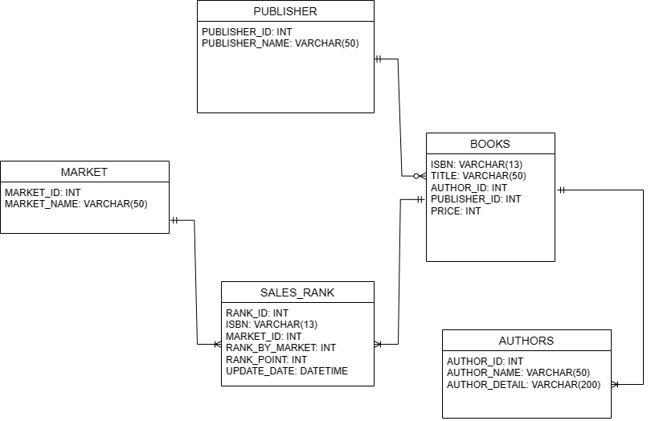

# Mini Project 2 : 웹스크래핑

## 24-02-07 작성

## 어떤 서비스를 만들것인가?
    두 곳 이상의 사이트에서 정보를 취합해 정리해서 보여주는 서비스.
## 정보를 취합하는 방식은 정기적으로 크롤링을 해서 DB에 넣어두는 방식

## 후보 서비스 군
    1. 극장에서 영화 예매
    2. 도서 사이트에서 진짜 베스트 찾기
    3. 중고차 사이트에서 차량 매매
    4. 부동산 사이트에서 매물 정보
## 서비스에 필요한 정보를 제공하고 있는 사이트는 무엇이 있나?
    1. 극장 : 롯데시네마, 메가박스, cgv
    2. 도서 : 알라딘, 교보, 예스24
    3. 중고차 : 엔카, KB차차차
    4. 부동산 : 부동산114, 다음부동산(직방과 같은 서비스?), 직방(다음부동산과 같은 서비스?), 다방
## DB에서 취합이 가능한 규격화 된 정보인가?
    1. 극장 : 영화 제목, 지역, 극장명, 시간 등으로 규격화
    2. 도서 : 동일한 제품, 약간의 할인율 차이만 존재
    3. 중고차 : 동일한 카테고리의 다양한 컨디션의 상품들
    4. 부동산 : 같은 카테고리의 다양한 컨디션이 존재
## 각 사이트에서 크롤링은 가능한가?
    1. 극장 : 대부분 동적사이트 난이도가 있음
    2. 도서 : 정적인 부분이 많이 않아 가능함
    3. 중고차 : 대부분 동적사이트 난이도가 있음
    4. 부동산 : 비교적 정적인 사이트라 가능하지만 비교 항목이 다양함.
## 위 내용을 Draw.io를 통해서 다이어그램으로 작성.

### MiniProject TimeTable

### System Flowchart

## 24-02-19 작성 *08일 약혼자의 외할아버지 장례식 상주 역할로 일정이 지연 됨.

### Logical ERD

### Physical ERD

### 대상 사이트 확정
광고, 예약, 다른물품이 없고 월간 베스트 20이상을 지원하는 사이트를 대상으로 함  
- Yes24
link : https://www.yes24.com/Product/Category/MonthWeekBestSeller?categoryNumber=001

- 교보문고
link : https://product.kyobobook.co.kr/bestseller/total?period=003#?page=1&per=20&period=003&ymw=&bsslBksClstCode=A

- 알라딘
link : https://www.aladin.co.kr/shop/common/wbest.aspx?BranchType=1&BestType=MonthlyBest

